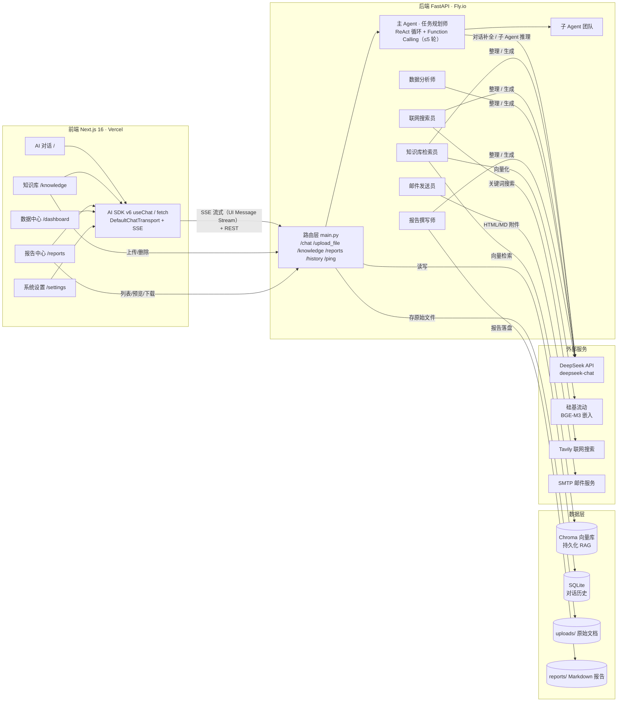

# 技术方案 — Multi-Agent 智能调研与知识库助手（Knowledge AI）

> 版本：v1.0（2026-08-16）
> 配套文档：[PRD](./PRD.md) | [验收标准](./ACCEPTANCE.md) | [测试用例](../../../my-ai-chat-back/python-backend/tests/)
> 依据：当前已落地代码（复盘）+ 未来规划（多租户 / 数据中心 / 系统设置等）

---

## 0. 全链路架构图（Mermaid）



**链路说明**：用户在前端任一页面操作 → 前端经 `NEXT_PUBLIC_API_URL` 通过 SSE/REST 调后端 → 后端 `/chat` 由主 Agent 按意图调度子 Agent → 子 Agent 分别访问 Chroma RAG / Tavily / DeepSeek / SMTP → 流式结果回传前端实时渲染；知识库与报告文件落盘于后端目录，前端只做展示。

---

## 1. 整体架构设计

### 1.1 架构风格：前后端分离 + Agent 编排

```
┌────────────┐    SSE / REST     ┌──────────────┐    Function Calling    ┌──────────────┐
│  Next.js   │ ────────────────► │   FastAPI    │ ─────────────────────► │ DeepSeek LLM │
│  (Vercel)  │ ◄──────────────── │   (Fly.io)   │ ◄───────────────────── │  (5 子 Agent)│
└────────────┘    UI Message     └──────────────┘       工具结果回传      └──────────────┘
        │              Stream           │
        │                               ├─ RAG：Chroma + BGE-M3
        │                               ├─ 搜索：Tavily
        │                               ├─ 报告：report_generator（Markdown/HTML）
        │                               └─ 邮件：SMTP
```

**核心设计决策**
1. **手写 ReAct 而非 LangChain Agent**：编排逻辑完全可控、易调试，依赖少；用 OpenAI 兼容 SDK 直连 DeepSeek。
2. **SSE 单向流式**：对话为「服务端 → 前端」单向流，SSE 足够且天然兼容 HTTP / 代理 / AI SDK。
3. **本地优先数据层**：SQLite + Chroma 本地持久化，满足单用户；为多租户演进预留迁移路径（PostgreSQL + pgvector）。
4. **能力正交**：检索、搜索、报告、邮件各自独立模块，可单独替换（如搜索换 SerpAPI、嵌入换 OpenAI）。

---

## 2. 技术选型及理由（每项 ≥2 个候选对比）

### 2.1 前端框架

| 方案 | 优点 | 缺点 | 结论 |
|------|------|------|------|
| **Next.js 16（选用）** | SSR/App Router、与 Vercel 深度集成、AI SDK v6 官方支持、生态成熟 | 较重，构建略慢 | ✅ 当前已是该栈 |
| Vite + React SPA | 轻量、启动快 | 需自建路由/SSR/部署链路，AI SDK 集成需拼装 | ❌ |
| Vue / Nuxt | 模板友好 | 前端 AI 生态（AI SDK）以 React 为主 | ❌ |

### 2.2 后端框架

| 方案 | 优点 | 缺点 | 结论 |
|------|------|------|------|
| **FastAPI（选用）** | 原生 `async` + `StreamingResponse`、Pydantic 校验、自动 OpenAPI、类型安全 | 生态相对 Django 略薄 | ✅ 当前已是该栈 |
| Flask | 简单直接 | 同步为主，流式需额外线程/生成器处理，校验靠手写 | ❌ |
| Django + DRF | 大而全、Admin 现成 | 异步支持弱、重量级、对 SSE 不友好 | ❌ |

### 2.3 Agent 编排方式

| 方案 | 优点 | 缺点 | 结论 |
|------|------|------|------|
| **手写 ReAct + Function Calling（选用）** | 全流程可控、易调试、无黑盒、成本透明；当前代码已实现且稳定 | 复杂编排需手写扩展 | ✅ |
| LangGraph | 图化编排、检查点/断点、可回放 | 学习成本高、抽象重、对现有代码是重构 | ❌ |
| LangChain Agent（executor） | 现成工具链 | 版本变动大、隐藏 Prompt 难调、黑盒 | ❌ |

### 2.4 向量库

| 方案 | 优点 | 缺点 | 结论 |
|------|------|------|------|
| **Chroma（选用）** | 本地持久化、零运维、LangChain 集成好、当前已落地 | 单机、不适合大规模并发 | ✅ 单用户阶段够用 |
| Qdrant | 分布式、过滤能力强、性能好 | 需自建服务/运维 | ❌ |
| pgvector | 与业务库同库、事务一致 | 需迁移 PostgreSQL，索引调参 | ⏳ 多租户阶段迁移目标 |

### 2.5 嵌入模型

| 方案 | 优点 | 缺点 | 结论 |
|------|------|------|------|
| **BGE-M3 @ 硅基流动（选用）** | 中文效果好、API 调用零运维、便宜 | 依赖外部服务（密钥/网络） | ✅ 当前已落地 |
| OpenAI text-embedding-3 | 多语种均衡 | 中文相对 BGE 无优势、成本更高 | ❌ |
| 本地部署 BGE-M3 | 数据不出内网 | 需 GPU 资源与运维 | ⏳ 有隐私要求时再评估 |

### 2.6 对话历史存储

| 方案 | 优点 | 缺点 | 结论 |
|------|------|------|------|
| **SQLite（选用）** | 零运维、单文件、事务可靠；当前单用户够用 | 写并发弱、多租户需隔离 | ✅ 当前阶段 |
| PostgreSQL | 并发强、JsonB、可上 pgvector | 需托管/运维 | ⏳ 多租户迁移目标 |
| Redis | 读写快 | 非持久化，不适合做唯一数据源 | ❌ 仅可做缓存 |

### 2.7 联网搜索

| 方案 | 优点 | 缺点 | 结论 |
|------|------|------|------|
| **Tavily（选用）** | AI 原生、返回整理后内容、API 简洁 | 免费额度有限 | ✅ 当前已落地 |
| SerpAPI | 结果结构完整 | 需自行清洗/解析，成本高 | ❌ |
| Google CSE | 便宜 | 结构化差、需拼装 | ❌ |

### 2.8 流式方案

| 方案 | 优点 | 缺点 | 结论 |
|------|------|------|------|
| **SSE（选用）** | 单向流、HTTP 兼容、自动重连、AI SDK 原生支持 | 不支持客户端→服务端流 | ✅ 对话是纯下行流 |
| WebSocket | 全双工、低延迟 | 需连接管理/心跳/重连，复杂度高 | ❌ 当前无双向流需求 |

---

## 3. 核心模块划分

### 3.1 前端（Next.js 16）

| 模块 | 文件 | 职责 |
|------|------|------|
| 页面层 | `app/page.tsx` / `knowledge` / `reports` / `dashboard` / `settings` | 5 大路由，内容区渲染 |
| 全局组件 | `components/top-bar.tsx` / `floating-dock.tsx` / `background-orbs.tsx` / `theme-provider.tsx` | 顶栏、底部导航、动态背景、暗黑模式 |
| 对话状态 | `useChat` + `DefaultChatTransport` | 管理消息、SSE 流式、工具调用展示 |
| 渲染 | ReactMarkdown + remarkGfm + rehypeHighlight | Markdown / GFM 表格 / 代码高亮 |
| API 客户端 | `fetch` → `NEXT_PUBLIC_API_URL` | 知识库、报告、历史等 REST 调用 |

### 3.2 后端（FastAPI）

| 模块 | 文件 | 职责 |
|------|------|------|
| 路由层 | `main.py` | 全部 API 端点 + 全局异常 + CORS |
| Agent 编排 | `agents.py` | 主 Agent 系统提示 + 5 个子 Agent Prompt |
| 向量检索 | `vector_store.py` | Chroma 增删查 + 按文件名删除 |
| 文档加载 | `document_loader.py` | PDF/Word/Excel/CSV/TXT/MD 切分 |
| 嵌入 | `embedding.py` | BGE-M3 嵌入配置 |
| 联网搜索 | `web_search.py` | Tavily 封装 |
| 报告生成 | `report_generator.py` | Markdown 落盘 + 转 HTML |
| 邮件 | `email_sender.py` | SMTP 正文 + HTML/MD 附件 |
| 历史 | `chat_history.py` | SQLite 对话持久化 |

---

## 4. 数据模型设计

### 4.1 当前表结构（已落地）

```sql
-- 会话表
CREATE TABLE conversations (
    id         INTEGER PRIMARY KEY AUTOINCREMENT,
    title      TEXT    DEFAULT '新对话',
    created_at TIMESTAMP DEFAULT CURRENT_TIMESTAMP
);

-- 消息表：conversations 1:N messages
CREATE TABLE messages (
    id              INTEGER PRIMARY KEY AUTOINCREMENT,
    conversation_id INTEGER NOT NULL REFERENCES conversations(id),
    role            TEXT NOT NULL,          -- 'user' | 'assistant' | 'tool' | 'system'
    content         TEXT NOT NULL,
    created_at      TIMESTAMP DEFAULT CURRENT_TIMESTAMP
);

-- 关系：
--   conversations (1) ──── (N) messages
```

### 4.2 规划表结构（多租户 / 数据中心演进）

```sql
-- 用户表（多租户基础）
CREATE TABLE users (
    id              INTEGER PRIMARY KEY AUTOINCREMENT,
    email           TEXT NOT NULL UNIQUE,
    hashed_password TEXT NOT NULL,
    created_at      TIMESTAMP DEFAULT CURRENT_TIMESTAMP
);

-- 文档表：记录上传元数据（支持数据中心统计）
CREATE TABLE documents (
    id          INTEGER PRIMARY KEY AUTOINCREMENT,
    user_id     INTEGER NOT NULL REFERENCES users(id),
    filename    TEXT NOT NULL,
    file_type   TEXT,                -- pdf/docx/xlsx/csv/txt/md
    size        INTEGER,
    chunk_count INTEGER,
    created_at  TIMESTAMP DEFAULT CURRENT_TIMESTAMP
);

-- 报告表：报告中心增强（重命名 / 批量删除 / 归属）
CREATE TABLE reports (
    id         INTEGER PRIMARY KEY AUTOINCREMENT,
    user_id    INTEGER NOT NULL REFERENCES users(id),
    filename   TEXT NOT NULL,
    title      TEXT,
    size       INTEGER,
    created_at TIMESTAMP DEFAULT CURRENT_TIMESTAMP
);

-- 用户偏好设置（系统设置页）
CREATE TABLE user_settings (
    user_id     INTEGER PRIMARY KEY REFERENCES users(id),
    model       TEXT    DEFAULT 'deepseek-chat',
    temperature REAL    DEFAULT 0.7,
    top_k       INTEGER DEFAULT 3
);

-- 关系：
--   users (1) ──── (N) conversations ──── (N) messages
--   users (1) ──── (N) documents
--   users (1) ──── (N) reports
--   users (1) ──── (1) user_settings
```

> 迁移路径：`conversations` / `messages` 增加 `user_id` 列；Chroma 向量 metadata 增加 `user_id` 做隔离；`documents` / `reports` 由「目录扫描」改为「元数据表 + 文件对象存储」。

---

## 5. API 接口设计

### 5.1 当前已实现

| 方法 | 路径 | 说明 | 请求 | 响应 |
|------|------|------|------|------|
| GET | `/ping` | 健康检查 | — | `{"message":"pong"}` |
| POST | `/chat` | 多 Agent 对话（流式） | `{id, messages[], trigger}` | SSE：`text-start→text-delta→text-end→finish` |
| POST | `/upload_file` | 上传文档并入向量库 | `multipart/form-data: file` | `{message, filename, chunks}` / `{error}` |
| GET | `/knowledge` | 知识库文件列表 | — | `{files:[{filename,size}]}` |
| GET | `/knowledge/{fn}` | 下载原始文档 | — | 文件流 / `{error}` |
| DELETE | `/knowledge/{fn}` | 删除文档 + 向量 + 清历史 | — | `{message}` |
| GET | `/reports` | 报告列表 | — | `{reports:[{filename,size}]}` |
| GET | `/reports/{fn}` | 下载/预览报告 | — | Markdown 文件流 / `{error}` |
| GET | `/history` | 最近对话历史 | — | `{messages:[{role,content}]}` |
| DELETE | `/history` | 清空对话历史 | — | `{message}` |

### 5.2 规划接口（多租户 / 数据中心 / 设置）

| 方法 | 路径 | 说明 |
|------|------|------|
| POST | `/auth/register` · `/auth/login` | 注册 / 登录（JWT） |
| GET | `/me` | 当前用户信息 |
| GET | `/stats/overview` | 总文档数 / 总对话数 / Token 用量 |
| GET | `/stats/top-questions` | 热门问题 Top10 |
| GET | `/stats/kb-trend` | 知识库使用趋势（时间序列） |
| PUT | `/settings` | 模型 / Temperature / Top-K 保存 |
| PATCH | `/reports/{id}` | 报告重命名 |
| DELETE | `/reports` | 批量删除报告 |

**统一约定**：错误统一返回 `{"error": string}`；鉴权后所有资源路径按 `user_id` 隔离；流式端点保持 `text/event-stream`。

---

## 6. 部署方案

### 6.1 双端部署拓扑

```
浏览器 ──► Vercel（Next.js 静态/SSR）──► Fly.io（FastAPI）
                     ▲                        │
              NEXT_PUBLIC_API_URL      CORS 白名单 ALLOW_ORIGINS
```

| 端 | 平台 | 部署方式 | 环境变量 |
|----|------|----------|----------|
| 前端 | Vercel | Git 推送自动部署 | `NEXT_PUBLIC_API_URL`（指向上线后端地址） |
| 后端 | Fly.io | `fly deploy`（Docker） | `DEEPSEEK_API_KEY` / `SILICONFLOW_API_KEY` / `TAVILY_API_KEY` / `SMTP_*` / `ALLOW_ORIGINS` |

### 6.2 关键配置

- **后端密钥**：一律走 Fly.io secrets（`fly secrets set DEEPSEEK_API_KEY=...`），不落镜像。
- **CORS**：`ALLOW_ORIGINS` 逗号分隔白名单，生产只填 Vercel 域名。
- **持久化**：Fly.io volume 挂载 `chroma_db/`、`uploads/`、`reports/`、`chat_history.db`，保证重启不丢数据（当前 Docker 分层需显式挂载，见 NFR-AC-05）。
- **CI 建议**：PR 触发 `npm run build`（前端）+ `pytest tests/`（后端）双门禁；通过后自动部署。

### 6.3 迁移计划（多租户）

1. 后端新增 `/auth/*` 与 JWT 鉴权中间件；
2. `conversations/messages` 增 `user_id`，历史 API 按用户过滤；
3. SQLite → PostgreSQL（保留兼容层过渡）；
4. 数据目录按用户分桶，`documents/reports` 入库管理；
5. 部署前给 Chroma metadata 加 `user_id` 隔离，存量数据脚本化迁移。

---

## 7. 风险评估

| 风险 | 影响 | 等级 | 缓解措施 |
|------|------|------|----------|
| **RAG 幻觉 / 检索质量** | 回答不准确、引用错误 | 🔴 高 | 子 Agent 只基于检索结果作答（Prompt 已约束）；Top-K 合并去重；后续加评估集回归 |
| **多 Agent 成本与延迟** | 多轮 LLM 调用，费用/耗时上升 | 🟡 中 | 流式展示掩盖等待感；`max_iterations=5` 上限；后续加工具级缓存 |
| **无鉴权 / 单用户** | 数据暴露、不可多人使用 | 🔴 高（演进前） | 当前限定单机部署；按 §6.3 多租户迁移；生产前置鉴权 |
| **密钥泄露** | 被盗用产生费用 | 🔴 高 | 全部走 env/secrets；.env 不入库；定期轮换；CI 密钥扫描 |
| **SQLite 写并发 / 单文件** | 多请求写冲突、损坏风险 | 🟡 中 | 当前单用户影响小；迁移 PostgreSQL（见 §2.6） |
| **Chroma 单机 / 数据一致性** | 向量库与文件不同步 | 🟡 中 | 删除走「文件+向量+历史」联动事务；同名覆盖先删后写 |
| **Fly.io 存储未挂载** | 重启丢数据 | 🔴 高 | 部署时必须挂 volume；用 `/ping` + 数据探针验证 NFR-AC-05 |
| **邮件进垃圾箱** | 报告邮件不可达 | 🟡 中 | SMTP 域名信誉、正确 DKIM/SPF；失败显式返回 ❌ 原因 |
| **双对话链路并存** | 前后端职责不清、维护成本 | 🟡 中 | 当前前端实际走后端 `/chat`；`app/api/chat/route.ts`（AI SDK 直连）建议下线或明确用途 |
| **前端历史不恢复** | 刷新后对话视图丢失 | 🟡 中 | 后端已有 `/history`；前端接入恢复逻辑（M1-AC-15） |

---

## 8. 交付路线（与 PRD 里程碑对齐）

| 阶段 | 内容 | 验收依据 |
|------|------|----------|
| 已交付 | 布局重构 · 暗黑模式 · 多 Agent 对话 · 知识库 RAG · 报告中心 · 邮件 | 验收标准 ✅ 条目 |
| P1 | 测试套件落地（本方案配套）· Toast · 消息复制/重新生成 · 历史恢复 | M1-AC-14/15 |
| P2 | 知识库搜索/批量删除/预览 · 报告重命名/批量删除 | M2-AC-11~13、M3-AC-08/09 |
| P3 | 数据中心统计可视化（引入 recharts） | M4-AC-01~03 |
| P4 | 系统设置：API Key 管理 / 模型参数 | M5-AC-01/02 |
| P5 | 多租户：鉴权 + PostgreSQL + 目录入库 | §6.3 |
